# ARCHITECTURE — 지금 무엇이 있고 어떻게 이어져 있나

**이 문서는 사실 기록이지 규칙이 아니다.** 규칙은 [CLAUDE.md](CLAUDE.md)와 각 폴더의
`CLAUDE.md`에 있고, 그쪽은 게임이 바뀌어도 그대로 참인 것만 담는다. 여기 적힌 것은 반대로
**오늘의 상태**라서, 카드 한 장이 덱에서 빠지거나 클래스 하나가 이름을 바꾸면 같이 바뀐다.

둘을 나눈 이유가 있다. `CLAUDE.md`는 매 작업마다 지시문으로 읽힌다 — 거기 낡은 문장이
있으면 조용히 방치되는 게 아니라 **그대로 실행된다.** 실제로 그런 일이 있었다: 존재하지도
않는 `CardController`에 입력을 넣으라고, 삭제된 `CardTooltipView`를 쓰라고 적혀 있었다.

내용이 아래 중 하나에 해당하면 `CLAUDE.md`가 아니라 여기 적는다.

- 클래스·파일·노드 **이름**
- 상수의 **현재 값** (임계값, 데미지, 장수)
- 지금 구현이 **어디까지** 왔는지
- 무엇이 무엇을 **참조**하는지

---

## 1. 세 개의 프로젝트와, 컴파일러가 지키는 경계

```
RockAndScissPaper.csproj   Godot.NET.Sdk   씬 · 노드 · 입력 · RPC · UI
        │
        └── references ──▶ GameLogic/      Microsoft.NET.Sdk   순수 규칙, 참조 없음
                                ▲
Tests/  xUnit ──────────────────┘          GameLogic만 참조
```

화살표가 **한 방향뿐인 것이 이 프로젝트의 핵심 구조다.** `GameLogic`은 아무것도 참조하지
않으므로 `using Godot;`이 `error CS0246`으로 컴파일 실패한다 — 규율이 아니라 빌드가 막는다.

측정으로 확인함: `GameLogic/` 안의 어떤 파일도 `RockAndScissPaper.Autoload`,
`.Match3D`, `.UI`, `.Cards`, `.Network` 중 무엇도 이름조차 언급하지 않는다.

덕분에 **테스트가 Godot 없이 0.1초에 돈다** — 지금 덱이 뽑을 수 있는 메커니즘을 검증하는
75개가 돌고, 공백/조커/능력카드에 딸린 52개는 `DormantMechanics.REASON`으로 건너뛴다
(전체 127개. 스킵된 `[Theory]`는 `InlineData` 행이 펼쳐지지 않아 한 개로 세어진다).
라운드 판정처럼 분기가 많고 틀리기 쉬운
코드를 두 인스턴스 띄워 클릭해서 검증하는 대신 함수 호출로 검증할 수 있다는 뜻이다.

## 2. 폴더 지도

| 폴더 | 무엇이 | 타입 수 |
|---|---|---|
| `GameLogic/` | 규칙. 판정·덱·패·세션 | 22 |
| `GameLogic/Effects/` | 능력카드 4종 + `ICardEffect` | 5 |
| `Scripts/Autoload/` | 전역 서비스 5개 + `MatchView` | 9 |
| `Scripts/Cards/` | `CardData`(Resource), `DeckAssembler` | 2 |
| `Scripts/Match3D/` | 3D 매치 화면 전부 | 18 |
| `Scripts/Network/` | `CardChoiceCodec` (선택 ↔ RPC 정수 배열) | 1 |
| `Scripts/UI/` | 타이틀 · 접속 · 디버그 하네스 · `ScreenRouter` | 4 |
| `Deprecated/` | 2D 표현 계층. **컴파일 글롭 밖** | — |

## 3. 상속 — 얕다, 의도적으로

**커스텀 클래스가 커스텀 클래스를 상속하는 경우가 하나도 없다.** 모든 노드 스크립트는
Godot 기반 클래스에서 정확히 한 단계다.

| 기반 클래스 | 개수 |
|---|---|
| `Node3D` | 8 |
| `Control` | 6 |
| `Node` | 5 (Autoload 전부) |
| `Camera3D` / `VBoxContainer` / `Resource` | 각 1 |

유일한 다형성은 **`ICardEffect` 구현 4개**(`ResetEffect`, `SwapEffect`, `TransformEffect`,
`DrawEffect`)다. 카드 변종을 `ResetCard : AbilityCard : Card`로 만들지 않는다는 규칙이 실제로
지켜진 결과 — 카드는 `ECardName` 값으로 식별되고, 행동만 인터페이스로 조립된다.

`Node`를 상속하지 않는 순수 C# 헬퍼도 여럿 있다: `RoundedCardMesh`(메쉬 생성),
`BoneLookRotator`(본 회전 수학), `CharacterAnimationController`(AnimationPlayer 래퍼),
`MixamoRig`(본 이름·스켈레톤을 다운로드마다 다른 접두사·아마추어 이름 없이 찾는 정적
헬퍼 — `HeadFollowCamera`, `RemoteHeadLook`, `ScissorsController`, `CharacterHeadFade`
넷이 공유), `AnimationDebugPanel`, `DeckAssembler`, `ScreenRouter`, `CardChoiceCodec`.

## 4. 참조 그래프

소스에서 추출한 것이다. 화살표는 "A가 B의 이름을 안다".

```mermaid
graph TD
    subgraph UI["Scripts/UI"]
        TitleScreenUI
        ConnectionScreenUI
        ScreenRouter
        MatchDebugUI
    end
    subgraph M3D["Scripts/Match3D"]
        MatchWorldView
        HandView
        CardView
        HeadFollowCamera
        ScissorsController
        HealthBarsUI
        SegmentedHealthBarUI
        OverheadHealthBarUI
        DamageVignetteUI
        MatchLogPanel
        SubmitTimeoutGaugeUI
        RemoteHeadLook
        BoneLookRotator
        CharacterAnimationController
    end
    subgraph AL["Scripts/Autoload"]
        GameState
        NetworkManager
        EventBus
        CardDatabase
        AudioManager
        MatchView
    end
    subgraph GL["GameLogic"]
        MatchSession
        RoundResolver
        ICardEffect
        MatchLog
        ECardName
    end

    TitleScreenUI --> ScreenRouter
    TitleScreenUI --> ConnectionScreenUI
    ConnectionScreenUI --> GameState
    ConnectionScreenUI --> NetworkManager
    ConnectionScreenUI --> ScreenRouter
    MatchDebugUI --> GameState

    MatchWorldView --> GameState
    MatchWorldView --> HandView
    MatchWorldView --> CardView
    MatchWorldView --> HeadFollowCamera
    MatchWorldView --> ScissorsController
    MatchWorldView --> CharacterAnimationController
    MatchWorldView --> HealthBarsUI
    MatchWorldView --> DamageVignetteUI
    HandView --> CardView
    HandView --> GameState
    HealthBarsUI --> GameState
    HealthBarsUI --> SegmentedHealthBarUI
    OverheadHealthBarUI --> SegmentedHealthBarUI
    MatchLogPanel --> GameState
    SubmitTimeoutGaugeUI --> GameState
    RemoteHeadLook --> GameState
    RemoteHeadLook --> BoneLookRotator
    HeadFollowCamera --> GameState
    HeadFollowCamera --> BoneLookRotator

    GameState --> MatchSession
    GameState --> MatchView
    GameState --> MatchLog
    GameState --> EventBus
    NetworkManager --> EventBus
    CardView --> CardDatabase
    MatchLogPanel --> CardDatabase

    MatchSession --> RoundResolver
    RoundResolver --> ICardEffect
    MatchSession --> ECardName
```



### 여기서 읽어야 할 세 가지

**`GameState`가 유일한 관문이다.** 화면 쪽 9개 스크립트가 전부 `GameState`만 바라보고,
`MatchSession`을 직접 만지는 것은 `GameState` 하나뿐이다. 호스트에서도 화면은
`GameState.View`만 읽는다는 규칙이 구조로 굳어 있다는 뜻이다 — 상대 패를 읽으려면 규칙을
어기는 게 아니라 **없는 경로를 새로 뚫어야 한다.**

**`ECardName`의 피참조 26회 — 압도적 1위.** 이게 경계를 넘나드는 유일한 카드 타입이라는
설계가 숫자로 드러난다. `CardData`(그림·이름)는 표현 계층에서만 등장한다.

**Autoload끼리는 서로를 모른다.** `NetworkManager → EventBus`, `GameState → EventBus`
뿐이고 둘이 직접 붙지 않는다 — 신호는 `EventBus`를 거친다.

### 피참조 순위 (상위 8) — `python Tools/TypeGraph/extract_type_graph.py`로 재생성

| 타입 | 피참조 |
|---|---|
| `ECardName` | 26 |
| `CardChoice` / `GameState` | 11 |
| `DeckAndHand` | 7 |
| `Hand` / `MatchSession` / `EWinLossResult` | 6 |
| `Deck` / `ECardFate` | 5 |

덱-없음 개편([DESIGN.md](DESIGN.md)의 「손패와 보충」)으로 `MatchSession`·`EWinLossResult`·
`Deck`·`Hand`·`DeckAndHand`의 피참조가 일제히 줄었다 — 덱 고갈을 검사하던 코드가 통째로
빠지면서 그 타입들을 아는 곳도 같이 줄었다.

## 5. 한 라운드가 흐르는 길

```
[클라] CardView 제스처 ─▶ HandView ─▶ GameState.RequestCardPlay
                                            │  호스트면 로컬, 아니면 peer 1로 RPC
                                            ▼
                            GameState.HandleSubmission ─▶ MatchSession.SubmitCard
                                            │                      │
                                            │                      ▼ 양쪽 다 내면
                                            │              RoundResolver.Reveal → Finish
                                            ▼
                     공개는 전원에게 / 손패는 해당 peer에게만 (targeted RPC)
                                            ▼
                        GameState.View 갱신 + 시그널 ─▶ 화면 9개가 각자 반응
```

## 6. 현재 상태 — 자주 바뀌는 사실들

### 손패와 카드 — 덱이라는 게 없다

- **플레이어가 보는 덱은 없다.** 자세한 이유는 [DESIGN.md](DESIGN.md) 「덱 — 없다」.
  `Deck`은 여전히 존재하지만 **다 뽑히면 처음 구성으로 스스로 다시 채우고 셔플한다** —
  규칙이 아니라 보급원. `Deck(cards)`는 빈 목록을 생성자에서 거부한다
  (`ArgumentException`) — 채울 카드가 없는 덱은 나중 드로우에서가 아니라 만드는 시점에
  터진다
- **손패 5장, 다 쓰면 5장 통째로 리필** (`MatchSession.HAND_SIZE`,
  `DeckAndHand.RefillHandIfSpent`). 매 라운드 1장씩 보충되던 옛 멀리건 방식이 아니다 —
  `RefillHandIfSpent`는 손패가 **완전히 비었을 때만** 작동해서, 능력 효과가 카드를
  중간에 넣어도 조용히 덮어쓰지 않는다
- **덱 고갈로 인한 매치 패배는 없다.** `MatchSession.Winner`는 이제 체력만 본다
- 덱은 여전히 9장 구성(가위/바위/보 각 3장, `DeckAssembler.NORMAL_CARD_COPIES = 3`)이고,
  공백·조커·능력카드 4종은 **덱에서만** 빠졌다. `ECardName`에 이름이 남아 있고
  `RoundResolver`가 여전히 해결하며 테스트도 통과한다 — 되돌리는 건 `AddCopies` 한 줄
- 체력 10 (`MatchSession.STARTING_HEALTH`), 데미지 바위 2 / 가위 1 / 보 1
  (`WinLossRules`)

### 잠들어 있는 코드 (죽은 게 아님)

- **교체/변화 선택 흐름** — `GameState`의 RPC 2개, 헬퍼 5개, 타이머 1개가 살아 있고
  컴파일되고 테스트되지만 **유발할 카드가 덱에 없다.** 능력카드가 아이템으로 돌아올 때를
  기다리는 상태
- **능력 효과 4종**(`DrawEffect`/`ResetEffect`/`SwapEffect`/`TransformEffect`)도 같은
  이유로 컴파일 상태만 유지 중 — `Random`을 받도록만 손패 개편에 맞춰 갱신했다. 삭제하지
  않은 건 아이템 설계가 아직 없어서, 지우면 나중에 기억만으로 다시 써야 하기 때문
- **미사용 번역 키 23개** — 대부분 능력카드 프롬프트(`MATCH_PROMPT_*`, `MATCH_ACTION_*`,
  `MATCH_OUTCOME_*`)와 아직 안 만든 매치 종료 화면(`MATCH_END_*`), 카드 종류 뱃지
  (`CARD_TYPE_*`). 위와 같은 이유로 남겨둔 것이고, 10선승 시절 점수판 3개
  (`MATCH_WINS_NEEDED` 등)는 규칙 자체가 없어졌으므로 지웠다
- **`MatchView.MyDeckCount`/`OpponentDeckCount`** — 여전히 RPC로 오가지만 덱이 보급원으로
  바뀐 뒤로는 "다음 재보충까지 남은 장수"라는, 플레이어에게 아무 의미 없는 숫자다.
  `MatchDebugUI`만 찍고 3D 화면은 아무것도 안 보여준다 — 걷어내려면 RPC 시그니처까지
  건드려야 해서 아직 안 했다

### 연출

- 제출 제스처: 홀드 → 위로 뷰포트 높이의 25%
  (`CardView.SUBMIT_THRESHOLD_VIEWPORT_FRACTION`) → 놓기. 제출 가능해지면 카드 위에
  "제출" 콜아웃이, 호버 중이면 화살표가 뜬다 — 같은 `Label3D` 노드를 재사용
  (`CardView.Callout`)
- 제출된 카드는 손에 있을 때의 2배 (`MatchWorldView.SUBMITTED_CARD_SCALE`)
- 라운드 페이싱: 인트로 2s → Open → 뒤집기 0.35s → **결과 대기 0.3s
  (`RESULT_BEAT_SECONDS`, 카드가 뒤집힌 걸 읽을 시간)** → 승리 동작 → 정리 0.5s
  (`MatchWorldView.EPresentationPhase`)
- 제출 제한시간 45s (`GameState.SUBMIT_TIMEOUT_SECONDS`)
- 승리 동작 3종 전부 연출이 있다 — 바위(펀치)·가위(찌르기)·**보(책상 내려치기,
  `Anim_Paper_Flip_Baked`)**. 임팩트 프레임은 전부 본 회전 각속도를 측정해서 잡았다:
  바위 0.5s, 가위 `ScissorsController.STRIKE_SECONDS`, 보 0.65s. 임팩트 순간 양쪽
  화면 모두 카메라가 흔들린다(`HeadFollowCamera.Shake`) — 강도는 바위 1.0 / 가위 0.7 /
  보 0.55, 코사인 두 개를 다른 주파수로 겹쳐 감쇠시킨 회전만의 흔들림(위치는 안 건드림)
- **마우스 시선과 애니메이션의 머리 본 소유권이 부드럽게 넘어간다**
  (`BoneLookRotator.RampedAuthority`). 클립이 가져갈 때는 0.12s, 돌려줄 때는 0.35s —
  본을 지금 실제로 있는 자세에서 slerp하므로 로컬(`HeadFollowCamera`)과
  리모트(`RemoteHeadLook`) 양쪽 다 클립이 어디서 끝나든 안 끊기고 넘어온다
- 머리 시선 동기화 15Hz 송신, 수신측 보간 (`RemoteHeadLook`)
- 가위 프롭: 0.70s에 손에 붙고 1.733s에 상대 손등 마커에 고정, **그 다음 라운드의 제출이
  끝나는 순간**(그 라운드의 `OnRoundRevealed`, 카드가 뒤집히기 직전) 회수된다
  (`ScissorsController`) — 라운드 수를 세지 않는다. 찌르기 자체가 `PlayWinningBlow`의
  결과물이라 다음에 오는 리빌은 항상 "그 다음 라운드"의 것이기 때문
- 찌르는 순간 상처에서 피가 위로 튄다(`Scenes/Match3D/BloodSpray.tscn`, 원샷
  `GPUParticles3D`, `Finished` 시그널로 자기 자신을 정리)
- **주먹이 닿는 프레임에 맞은 쪽 상체가 뒤로 꺾인다**(`CharacterHitRecoil`, 척추 3본에
  22도를 5:3:2로 나눠 건다). 3박자다 — 즉시 꺾임 / 0.15초 정지 / 1.0초 복귀(smoothstep).
  **셰이크처럼 지수 감쇠를 쓰면 안 된다**: 지수는 시작 순간이 가장 빠른 곡선이라 도착한
  프레임에 이미 돌아오기 시작하고, 감쇠율을 아무리 낮춰도 "멈춤"이 생기지 않는다.
  셰이크가 지수를 쓰는 건 그쪽은 그 모양이 맞아서다(첫 프레임이 가장 세고 곧 사라짐).
  카메라 셰이크와 달리 **의도적으로 비대칭이다** —
  내가 바위로 이겼을 때 상대 몸에만 걸린다. 진 쪽 화면은 그 캐릭터의 눈에서 보는 1인칭이라
  꺾일 몸이 애초에 안 보이고, 맞은 느낌은 양쪽에서 터지는 셰이크가 이미 담당한다.
  네트워크를 타지 않는다(양쪽이 같은 결과를 이미 갖고 있고 각자 그릴 게 있는지만 판단).
  바위 전용 — 보는 책상을 치고, 가위는 손을 책상에 박아두므로(`ScissorsController`) 몸을
  젖히면 박힌 손이 소품에서 떨어져 나간다
- **손은 책상에 붙어 있는다.** 두 팔이 척추 위에 달려 있어 그냥 굽히면 딸려 올라간다
  (실측: 22도에서 양손이 수직으로 9.5cm 부상 — 상판에 놓인 손바닥이 뜬다). 그래서 손의
  월드 위치·자세를 척추와 같이 적립해두고 매 프레임 되돌린다: **팔꿈치 각도를 코사인
  법칙으로 풀어 어깨-손목 거리를 맞춘 뒤, 어깨를 겨냥해 방향을 맞춘다.** 이 순서가
  1패스로 정확한 이유는, 관절마다 목표를 겨냥하는 일반적인 CCD는 **방향만** 고치는데
  척추를 굽힌 뒤 남는 오차는 대부분 반경 방향이기 때문이다 — 그 방식은 3패스에도 손목이
  11mm 어긋난 채였고, 지금은 전 구간 최대 0.33mm다. 22도에서 팔 여유가 1.7cm뿐이라
  팔이 거의 펴진 채로 버티는 모양이 되고, 28도쯤이면 아예 안 닿는다
- `Skeleton3D.ForceUpdateAllBoneTransforms()`는 4.7에서 deprecated다(내부 전용).
  **부를 필요도 없다** — `GetBoneGlobalPose`가 스스로 최신화한다(실측: 부모 본에 포즈를
  쓴 직후 자손을 강제 갱신 없이 읽은 값이 강제 갱신본과 소수점 6자리까지 동일)
- 회복 각도는 **타격 시점에 적립한 포즈 기준**으로 매 프레임 절대값을 쓴다. 현재 포즈에
  곱해 누적하면 안 된다 — 진 쪽은 `AnimationPlayer`가 멈춰 있어서 뼈를 다시 써주는 게
  없으므로 프레임마다 굽힘이 쌓인다(실측: 6프레임 만에 0.48m까지 갔다가 반 바퀴를 넘겨
  몸 **앞으로** 나왔다)
- **매치 화면에는 전역 무채색 필터가 없다.** 한때
  [MonochromeExceptRed.gdshader](Shaders/MonochromeExceptRed.gdshader)를 화면 전체에
  걸어 빨강만 남겼고, 그래서 피가 화면에서 색을 가진 유일한 순간이었다. 지금 그 셰이더가
  걸린 곳은 타이틀 화면(`TitleWorld.tscn`)뿐이다. 다만 탁상 알베도는 그 시절에 무채색으로
  구워져 있고 되돌리지 않았으므로(`ATTRIBUTIONS.md` 참고), 필터를 뗀 뒤에도 탁상은
  회색으로 남는다
- 체력은 `MatchSession.STARTING_HEALTH`칸으로 쪼갠 바다(`SegmentedHealthBarUI`).
  내 것은 우하단, 상대 것은 상대 머리 위 3D 마커를 매 프레임
  `Camera3D.UnprojectPosition`으로 따라간다(`OverheadHealthBarUI`). **화면 밖으로 나가면
  가장자리에 붙지 않고 그냥 사라진다** — 헤드 카메라 기본 자세가 탁상을 36도쯤 내려다보는
  각도라 아래를 볼수록 위로 밀려 나가는데, 그때 테두리에 붙여두면 화면에 보이지도 않는
  상대의 체력을 가리키고 있게 된다. 의도된 동작이니 버그로 고치지 말 것.
  깎인 칸마다 붉은 스파크가 터지고(가산 블렌딩 원샷 `GPUParticles2D`, 수명에 따라
  흰빛→붉은색→투명으로 식으며 줄어든다), 내가 맞은 경우에는 화면 가장자리가 붉어진다
  (`DamageVignetteUI` + [DamageVignette.gdshader](Shaders/DamageVignette.gdshader),
  잃은 체력 크기만큼 세기가 붙고 지수적으로 감쇠)
- **체력이 깎여 보이는 순간은 `RoundResolved`가 아니라 타격이 닿는 프레임이다.**
  `HealthBarsUI`는 그 신호를 구독하지 않고, `MatchWorldView`가 카메라를 흔드는 바로 그
  자리에서 `ShowCurrentHealth()`를 부른다 — 신호는 카드가 뒤집히기도 전에 오므로, 거기에
  붙여두면 리빌 전에 결과가 먼저 새어 나간다. 때릴 애니메이션이 없는 라운드(무승부 등)는
  `EnterResultHoldPhase`가 대신 커밋한다
- 애니메이션 클립은 **클립 하나당 `.glb` 하나**로 간다 — `Character.tscn`의
  `AnimationPlayer`가 `AnimationLibrary`를 여러 개 붙들고(첫 번째만 빈 이름 `&""`,
  그 뒤로는 `"paper/Anim_Paper_Flip_Baked"`처럼 이름이 붙는다). 기존 파일에 액션을
  합쳐 넣는 대신 이 방식을 택한 이유는
  [DevLogDoc/2026-09-02-per-clip-glb-and-head-handoff.md](DevLogDoc/2026-09-02-per-clip-glb-and-head-handoff.md) 참고
- 타이틀 화면도 이제 3D다 — `Scenes/Screens/TitleWorld.tscn`이 매치월드에서 라운드
  로직·손패뷰·마우스룩·UI를 전부 뺀 배경(조명·탁상·캐릭터 착석·가위·무채색 셰이더)이고,
  `TitleScreen.tscn`은 루트가 `Control`에서 `Node3D`로 바뀌어 그 위에 `World` 인스턴스와
  `Interface`(메뉴) 두 자식을 얹는다. 조명·환경·탁상은
  `MatchWorld.tscn`과 지금 복사본 관계라 한쪽만 고치면 갈라진다
- **접속 화면은 씬이 아니라 타이틀 화면 안의 패널이다.** `Interface/Menu/Layout` 아래에
  메인 메뉴 · 접속(`ConnectionScreenUI`) · 설정 세 패널이 있고, 게임 제목 바로 아래 한
  자리를 번갈아 쓴다 — `TitleScreenUI`가 셋 중 하나만 `Visible`로 둔다.
  `ConnectionScreen.tscn`과 `ScreenRouter.GoToConnectionScreen`은 그래서 없어졌다:
  씬을 갈면 뒤의 3D 탁상을 버리고 다시 세우게 되는데, 방 만들기/참가는 같은 메뉴의 다음
  몇 줄일 뿐이다. **씬이 아니게 되면서 생긴 유일한 새 책임은 "뒤로"** — 패널을 닫는 것과
  열려 있던 방을 정리하는 것이 같이 가야 한다(`ConnectionScreenUI.OnBackPressed`)
- 메뉴 UI는 상자 없는 좌측 정렬 텍스트 목록이고, 항목마다 `>` 캐럿 `Label`이 앞에 붙은
  `HBoxContainer` 한 줄이다. 생김새는 [Assets/Themes/TextMenu.tres](Assets/Themes/TextMenu.tres)
  하나에 모여 있다(`Button` 스타일박스를 전부 `StyleBoxEmpty`로 비우고 글자색으로만
  호버를 표현, 캐럿/제목/헤딩/상태줄은 `theme_type_variation`). **폰트는 여기 없다** —
  `Assets/Fonts/DefaultTheme.tres`(프로젝트 전역 테마)가 계속 맑은고딕을 대며, 테마 조회가
  못 찾은 항목은 위로 falling through 하기 때문이다. 여기에 `default_font`를 적으면
  한글 폰트가 두 곳에 생긴다
- 숨겨야 하는 항목은 **버튼이 아니라 줄(`HBoxContainer`)을 숨긴다** — 버튼만 숨기면
  캐럿 `>`가 홀로 남는다(호스트에게만 보이는 "매치 시작"이 이 경우다)
- 메뉴 배경음악은 꺼져 있다(`TitleScreenUI`의 `PlayMainMenuMusic()` 호출이 주석
  처리됨) — 2D 시절 톤이라 지금과 안 맞아서. `AudioManager`는 그대로라 되살리는 건
  주석 해제 한 줄

### 아직 없는 것

- 보(paper) 승리의 **부가 효과** — 상대 손패 3초 공개. 애니메이션은 이제 있지만
  효과는 없다. 상대 손패 자체가 3D 씬에 없다 — `MatchView.OpponentHandCount`는
  개수 하나뿐이고 3D에 상대 손패를 그리는 노드가 없다
- 가위 승리의 **부가 효과** — 다음 턴 아이템 사용 불가. 걸 아이템 자체가 없다
- 매치 종료 화면 — 로그 패널의 `=== 매치 승리 ===` 한 줄이 전부
- 아이템 시스템 — 설계 전
- 3D에서 카드 이름을 표시하는 수단 — [DESIGN.md](DESIGN.md)의 「명판」 절 경고 참고
- 두 인스턴스 실기 검증 — 머리 동기화·연결 끊김 오버레이·가위 연출 모두 단일 인스턴스
  측정만 되어 있다

## 7. 알려진 마찰

- **`GameState`가 1,073줄이다.** 전체에서 가장 길다. 위의 "잠들어 있는" 선택 흐름이 그중
  한 덩어리를 차지한다
- **`MatchWorldView`가 책임 6개를 갖는다** — 페이즈 머신, 제출 카드 슬래브, 승리 애니메이션,
  가위 프롭, 인트로 스플래시, **카메라 셰이크 타이밍(임팩트 프레임 3종)**
- **타이틀과 매치가 조명·환경·탁상을 복사본으로 들고 있다.** `TitleWorld.tscn`을 만들
  때 공통 부분을 별도 씬으로 뽑는 대신 복제했다 — 뽑으면 `MatchWorldView`/`HandView`/
  `ScissorsController`/`HeadFollowCamera`의 `GetNode` 경로가 전부 한 단계 깊어져서,
  지금은 위험 대비 이득이 안 맞는다고 판단했다. 조명을 자주 만지게 되면 그때 뽑을 것
- **Godot 에디터가 C# 파일을 탭으로 재들여쓰기한다.** `.editorconfig`가 4-space를 못박아
  뒀지만 Godot 내장 스크립트 에디터는 그걸 안 읽고 **에디터 설정**
  (`text_editor/behavior/indent/type`)을 따른다. 이 세션 중에도 8개 파일이 한 번 되돌아갔다
