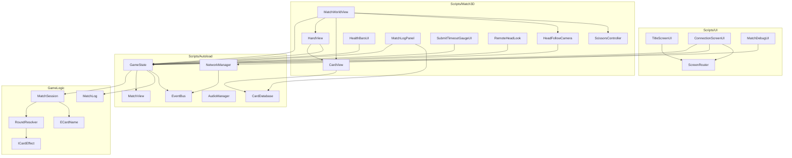

# ARCHITECTURE — 지금 무엇이 있고 어떻게 이어져 있나

**이 문서는 사실 기록이지 규칙이 아니다.** 규칙은 [CLAUDE.md](CLAUDE.md)와 각 폴더의
`CLAUDE.md`에 있고, 그쪽은 게임이 바뀌어도 그대로 참인 것만 담는다. 여기 적힌 것은 반대로
**오늘의 상태**라서, 카드 한 장이 덱에서 빠지거나 클래스 하나가 이름을 바꾸면 같이 바뀐다.

둘을 나눈 이유가 있다. `CLAUDE.md`는 매 작업마다 지시문으로 읽힌다 — 거기 낡은 문장이
있으면 조용히 방치되는 게 아니라 **그대로 실행된다.** 실제로 그런 일이 있었다: 존재하지도
않는 `CardController`에 입력을 넣으라고, 삭제된 `CardTooltipView`를 쓰라고 적혀 있었다.

내용이 아래 중 하나에 해당하면 `CLAUDE.md`가 아니라 여기 적는다.

- 클래스·파일·노드 **이름**
- 상수의 **현재 값** (임계값, 데미지, 장수)
- 지금 구현이 **어디까지** 왔는지
- 무엇이 무엇을 **참조**하는지

---

## 1. 세 개의 프로젝트와, 컴파일러가 지키는 경계

```
RockAndScissPaper.csproj   Godot.NET.Sdk   씬 · 노드 · 입력 · RPC · UI
        │
        └── references ──▶ GameLogic/      Microsoft.NET.Sdk   순수 규칙, 참조 없음
                                ▲
Tests/  xUnit ──────────────────┘          GameLogic만 참조
```

화살표가 **한 방향뿐인 것이 이 프로젝트의 핵심 구조다.** `GameLogic`은 아무것도 참조하지
않으므로 `using Godot;`이 `error CS0246`으로 컴파일 실패한다 — 규율이 아니라 빌드가 막는다.

측정으로 확인함: `GameLogic/` 안의 어떤 파일도 `RockAndScissPaper.Autoload`,
`.Match3D`, `.UI`, `.Cards`, `.Network` 중 무엇도 이름조차 언급하지 않는다.

덕분에 **테스트 144개가 Godot 없이 20ms에 돈다.** 라운드 판정처럼 분기가 많고 틀리기 쉬운
코드를 두 인스턴스 띄워 클릭해서 검증하는 대신 함수 호출로 검증할 수 있다는 뜻이다.

## 2. 폴더 지도

| 폴더 | 무엇이 | 타입 수 |
|---|---|---|
| `GameLogic/` | 규칙. 판정·덱·패·세션 | 22 |
| `GameLogic/Effects/` | 능력카드 4종 + `ICardEffect` | 5 |
| `Scripts/Autoload/` | 전역 서비스 5개 + `MatchView` | 9 |
| `Scripts/Cards/` | `CardData`(Resource), `DeckAssembler` | 2 |
| `Scripts/Match3D/` | 3D 매치 화면 전부 | 17 |
| `Scripts/Network/` | `CardChoiceCodec` (선택 ↔ RPC 정수 배열) | 1 |
| `Scripts/UI/` | 타이틀 · 접속 · 디버그 하네스 · `ScreenRouter` | 4 |
| `Deprecated/` | 2D 표현 계층. **컴파일 글롭 밖** | — |

## 3. 상속 — 얕다, 의도적으로

**커스텀 클래스가 커스텀 클래스를 상속하는 경우가 하나도 없다.** 모든 노드 스크립트는
Godot 기반 클래스에서 정확히 한 단계다.

| 기반 클래스 | 개수 |
|---|---|
| `Node3D` | 8 |
| `Control` | 6 |
| `Node` | 5 (Autoload 전부) |
| `Camera3D` / `VBoxContainer` / `Resource` | 각 1 |

유일한 다형성은 **`ICardEffect` 구현 4개**(`ResetEffect`, `SwapEffect`, `TransformEffect`,
`DrawEffect`)다. 카드 변종을 `ResetCard : AbilityCard : Card`로 만들지 않는다는 규칙이 실제로
지켜진 결과 — 카드는 `ECardName` 값으로 식별되고, 행동만 인터페이스로 조립된다.

`Node`를 상속하지 않는 순수 C# 헬퍼도 여럿 있다: `RoundedCardMesh`(메쉬 생성),
`BoneLookRotator`(본 회전 수학), `CharacterAnimationController`(AnimationPlayer 래퍼),
`AnimationDebugPanel`, `DeckAssembler`, `ScreenRouter`, `CardChoiceCodec`.

## 4. 참조 그래프

소스에서 추출한 것이다. 화살표는 "A가 B의 이름을 안다".



### 여기서 읽어야 할 세 가지

**`GameState`가 유일한 관문이다.** 화면 쪽 9개 스크립트가 전부 `GameState`만 바라보고,
`MatchSession`을 직접 만지는 것은 `GameState` 하나뿐이다. 호스트에서도 화면은
`GameState.View`만 읽는다는 규칙이 구조로 굳어 있다는 뜻이다 — 상대 패를 읽으려면 규칙을
어기는 게 아니라 **없는 경로를 새로 뚫어야 한다.**

**`ECardName`의 피참조 32회 — 압도적 1위.** 이게 경계를 넘나드는 유일한 카드 타입이라는
설계가 숫자로 드러난다. `CardData`(그림·이름)는 표현 계층에서만 등장한다.

**Autoload끼리는 서로를 모른다.** `NetworkManager → EventBus`, `GameState → EventBus`
뿐이고 둘이 직접 붙지 않는다 — 신호는 `EventBus`를 거친다.

### 피참조 순위 (상위 8)

| 타입 | 피참조 |
|---|---|
| `ECardName` | 32 |
| `CardChoice` | 14 |
| `GameState` | 11 |
| `DeckAndHand` / `MatchSession` / `EWinLossResult` | 9 |
| `Hand` | 8 |
| `Deck` / `ECardFate` | 7 |

## 5. 한 라운드가 흐르는 길

```
[클라] CardView 제스처 ─▶ HandView ─▶ GameState.RequestCardPlay
                                            │  호스트면 로컬, 아니면 peer 1로 RPC
                                            ▼
                            GameState.HandleSubmission ─▶ MatchSession.SubmitCard
                                            │                      │
                                            │                      ▼ 양쪽 다 내면
                                            │              RoundResolver.Reveal → Finish
                                            ▼
                     공개는 전원에게 / 손패는 해당 peer에게만 (targeted RPC)
                                            ▼
                        GameState.View 갱신 + 시그널 ─▶ 화면 9개가 각자 반응
```

## 6. 현재 상태 — 자주 바뀌는 사실들

### 덱과 카드

- **덱은 9장.** 가위/바위/보 각 3장. `DeckAssembler.NORMAL_CARD_COPIES = 3`
- 공백·조커·능력카드 4종은 **덱에서만** 빠졌다. `ECardName`에 이름이 남아 있고
  `RoundResolver`가 여전히 해결하며 테스트도 통과한다 — 되돌리는 건 `AddCopies` 한 줄
- 멀리건 4장 (`MatchSession.MULLIGAN_HAND_SIZE`)
- 체력 10 (`MatchSession.STARTING_HEALTH`), 데미지 바위 2 / 가위 1 / 보 1
  (`WinLossRules`)

### 잠들어 있는 코드 (죽은 게 아님)

- **교체/변화 선택 흐름** — `GameState`의 RPC 2개, 헬퍼 5개, 타이머 1개가 살아 있고
  컴파일되고 테스트되지만 **유발할 카드가 덱에 없다.** 능력카드가 아이템으로 돌아올 때를
  기다리는 상태
- **미사용 번역 키 23개** — 대부분 능력카드 프롬프트(`MATCH_PROMPT_*`, `MATCH_ACTION_*`,
  `MATCH_OUTCOME_*`)와 아직 안 만든 매치 종료 화면(`MATCH_END_*`), 카드 종류 뱃지
  (`CARD_TYPE_*`). 위와 같은 이유로 남겨둔 것이고, 10선승 시절 점수판 3개
  (`MATCH_WINS_NEEDED` 등)는 규칙 자체가 없어졌으므로 지웠다

### 연출

- 제출 제스처: 홀드 → 위로 뷰포트 높이의 25%
  (`CardView.SUBMIT_THRESHOLD_VIEWPORT_FRACTION`) → 놓기
- 제출된 카드는 손에 있을 때의 2배 (`MatchWorldView.SUBMITTED_CARD_SCALE`)
- 라운드 페이싱: 인트로 2s → Open → 뒤집기 0.35s → 승리 동작 → 정리 0.5s
  (`MatchWorldView.EPresentationPhase`)
- 제출 제한시간 45s (`GameState.SUBMIT_TIMEOUT_SECONDS`)
- 머리 시선 동기화 15Hz 송신, 수신측 보간 (`RemoteHeadLook`)
- 가위 프롭: 0.70s에 손에 붙고 1.733s에 상대 손등 마커에 고정, **다음 라운드 하나를 통째로
  버틴 뒤** 그 다음 라운드 인트로에 복귀 (`ScissorsController`)

### 아직 없는 것

- 보(paper) 승리 애니메이션 — `FindAnimationForWinningCard`가 null을 반환하고,
  덱이 가위바위보뿐이라 **승부가 갈리는 라운드의 약 1/3**이 무연출
- 매치 종료 화면 — 로그 패널의 `=== 매치 승리 ===` 한 줄이 전부
- 아이템 시스템 — 설계 전
- 3D에서 카드 이름을 표시하는 수단 — [DESIGN.md](DESIGN.md)의 「명판」 절 경고 참고
- 두 인스턴스 실기 검증 — 머리 동기화·연결 끊김 오버레이·가위 연출 모두 단일 인스턴스
  측정만 되어 있다

## 7. 알려진 마찰

- **`GameState`가 1,074줄이다.** 전체에서 가장 길다. 위의 "잠들어 있는" 선택 흐름이 그중
  한 덩어리를 차지한다
- **`MatchWorldView`가 책임 5개를 갖는다** — 페이즈 머신, 제출 카드 슬래브, 승리 애니메이션,
  가위 프롭, 인트로 스플래시
- **Godot 에디터가 C# 파일을 탭으로 재들여쓰기한다.** `.editorconfig`가 4-space를 못박아
  뒀지만 Godot 내장 스크립트 에디터는 그걸 안 읽고 **에디터 설정**
  (`text_editor/behavior/indent/type`)을 따른다. 이 세션 중에도 8개 파일이 한 번 되돌아갔다
